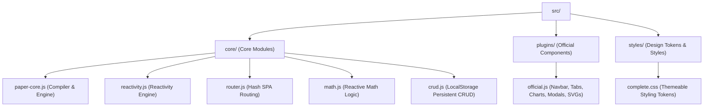

# 🤝 Contributing to Paper.js

Welcome, developer! If you want to make frontend development simpler, faster, and more fun for developers worldwide (especially the next-gen Gen Z creators), you are in the right place! 

This guide walks you through our high-speed modular architecture, build pipeline, design system, and testing rules so you can confidently contribute to Paper.js.

---

## 🏗️ Agile Modular Architecture (`src/` Directory)

Paper.js v3.0 has transitioned from a single-file codebase to a modular, highly scalable codebase located entirely under the `src/` folder. This ensures clean separation of concerns and lets multiple developers collaborate concurrently.



### 1. File Responsibilities
* **`src/core/paper-core.js`**: Element builder, selector parser (ID & class tokenization), tag spellcheck debugger, DOM mounting utilities, and local/cookie secure storage.
* **`src/core/reactivity.js`**: Vue/SolidJS-style dependency tracking framework containing `state`, `computed`, reactive DOM trackers, and dependency collector effects.
* **`src/core/router.js`**: Single-page application (SPA) routing based on url `location.hash` with wildcards and programmatic hooks.
* **`src/core/math.js`**: `paper.math` computed operations. Automatically tracks and updates formulas (`sum`, `sub`, `mul`, `div`, `avg`, `percent`, `round`) reactively.
* **`src/core/crud.js`**: `paper.crud` engine. Creates zero-config local database caches that synchronize CRUD operations (`create`, `read`, `update`, `delete`, `clear`) natively with `localStorage`.
* **`src/plugins/official.js`**: UI components, visual charts (canvas-based bar & ring charts), modals, tabs, autocomplete lists, toast managers, and high-performance SVG vector icons.
* **`src/styles/complete.css`**: Design tokens, dark mode gradients, glassmorphism layouts, variables, keyframe animations, and custom styling rules.

---

## ⚡ High-Speed Compiler Build Pipeline

We do not use Webpack, Rollup, or Vite for compilation. Instead, we use a zero-dependency automated compilation script `build.js` that compiles production bundles in **less than 5 milliseconds** using Node.js hrtime high-resolution metrics.

### Build Targets
1. **`paper.js` (Core Bundle)**: Bundles only core compiler files in `src/core/` inside a secure IIFE closure. Ideal for lightweight layouts.
2. **`paper-complete.js` (Complete Showcase Bundle)**: Combines all core files, official visual plugins, and auto-injects all CSS tokens from `src/styles/complete.css` so users can link one script and start coding immediately!

### How to Compile
Run the compiler from the root of the project:
```bash
node build.js
```

---

## 🎨 Design Aesthetics & Premium Tokens

To maintain our viral premium dark mode aesthetic, all styles, icons, and themes must align with the following rules:

1. **Color Palette (HSL Tailored CSS Variable System)**:
   * **Primary Accent**: Electric Violet/Blue (`--primary`: `linear-gradient(135deg, #6366f1 0%, #a855f7 100%)`)
   * **Secondary Accent**: Electric Teal (`--teal`: `#14b8a6`)
   * **Danger / Error Accent**: Rose Pink (`--rose`: `#f43f5e`)
   * **Background**: Sleek Deep Slate (`--bg`: `#090d16`)
   * **Surface Panels**: Semitransparent Obsidian (`--surface`: `rgba(13, 20, 35, 0.7)`)
2. **Visual Hierarchy (Glassmorphism)**:
   * Apply high-end glass backdrop filters (`backdrop-filter: blur(16px);`) combined with ultra-thin border outlines (`border: 1px solid rgba(255, 255, 255, 0.08)`).
3. **Typography**: Use modern geometric typography (e.g. `Inter` or `Outfit` fonts via Google Fonts CDN). Avoid serif browser defaults.
4. **SVG Icons**: Utilize optimized, inline SVG vector shapes via `paper.icon(name, options)` instead of emojis for clean rendering on high-DPI retina screens.

---

## 🧪 Testing & Code Verification

Quality assurance is paramount. Before submitting a Pull Request, ensure that your modifications compile perfectly and pass all test suites.

### 1. Mock Browser Environment Testing
Run our headless mock DOM suite to verify parser integrity, plugins registry, and runtime page execution:
```bash
node test-runner.js
```

### 2. Math Logic & CRUD Persistence Testing
Verify mathematical reactive computation trees and persistent local database operations:
```bash
node scratch/test-math-crud.js
```

### 3. Contribution Guidelines
* **XSS Defense**: Never use `innerHTML` directly. Always use the core compiler's secure element creator which handles standard content via `document.createTextNode` or structural HTML structures recursively.
* **State Mutability**: Maintain SolidJS/Vue principles. Modify reactive state values by setting `.value` property (e.g., `myState.value = newValue`) rather than reassigning variables.
* **Keep it Easy**: Code should be so intuitive that a developer can understand it within 2 minutes. Prioritize clean comments and comprehensive docstrings.

---

Let's collaborate to build the fastest, simplest, and most aesthetic HTML library in the world! 🚀
